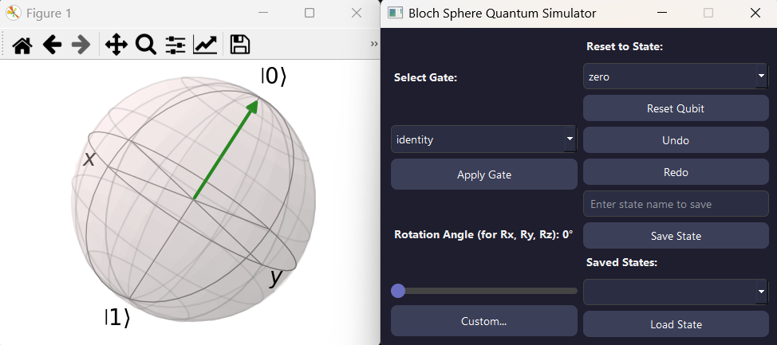

# Bloch Sphere Quantum Simulator

A PyQt5-based GUI application that visualizes single-qubit quantum states on the Bloch sphere and allows you to interact with quantum gates, state resets, and undo/redo operations.



## Features

-  Apply standard quantum gates (X, Y, Z, H, Phase, T)
-  Apply parameterized rotation gates (Rx, Ry, Rz)
-  Undo and redo operations with full state restoration
-  Save and load named qubit states
-  Define and apply custom 2x2 unitary gates
-  Visualize the current state live on a Bloch sphere

---

## Installation
### Option 1: Download Executable (Windows Only)

Download the latest standalone `.exe` from the [Releases page](https://github.com/mMelnic/bloch-sphere-simulator/releases). No Python installation required.

### Option 2: Run from Source
#### Prerequisites

- Python 3.7+
- `pip`

#### Install dependencies

```bash
pip install -r requirements.txt
```

Or manually:

```bash
pip install pyqt5 qutip numpy
```

---

## Running the App

```bash
python UI.py
```

The main window will launch with a Bloch sphere and control panels.

---

## Project Structure

```
bloch-sphere-simulator/
├── backend/
│   ├── quantum_simulator.py      # Core logic for state manipulation
│   ├── qubit_state.py            # Qubit state class
│   ├── quantum_gates.py          # Built-in and custom gate definitions
├── UI.py                         # PyQt5 GUI
├── README.md                     # This file
├── requirements.txt              # Python dependencies
```

---

## Custom Gate Support

You can define a custom gate by entering a 2x2 unitary matrix in the pop-up window and passing it to the simulator. Ensure the matrix is valid (unitary and syntactically correct) before applying.

Example input:
```
[1/sqrt(2)  1/sqrt(2)]
[1/sqrt(2) -1/sqrt(2)]
```

This will apply a Hadamard gate.

---

## Contributing

Pull requests are welcome. Please ensure your code is clean and tested.

---

## License

MIT License. See `LICENSE` file for details.

---